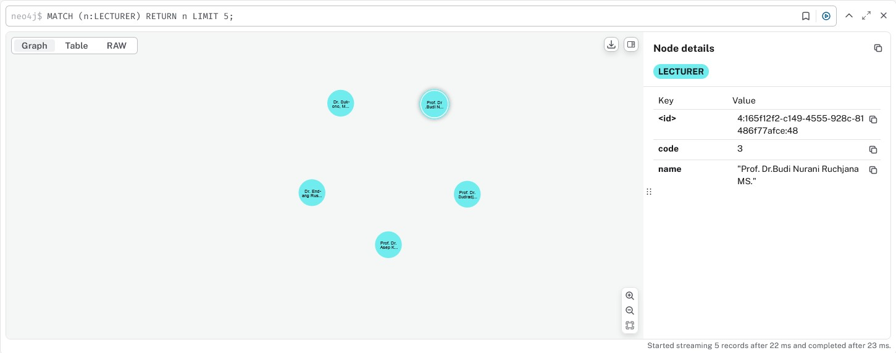

# GENERATE COURSE SCHEDULE USING GRAPH COLORING METHOD WITH NEO4J

## Prerequisite:
1. Docker
2. Python 3.8+

## Steps
1. Install Neo4j container
```PowerShell
docker compose up
```
2. Install all required libraries
```Python
pip install -r requirements.txt
```

3. Initiate data
```Python
python initial_data.py
```

You will get three entities; COURSE, LECTURE, AND STUDENT with example in the following images.

<br></br>
<br></br>
<br></br>

4. Connect Lectures and Students to Courses
```Python
python query/lectures-courses.py

python query/students-courses.py
```