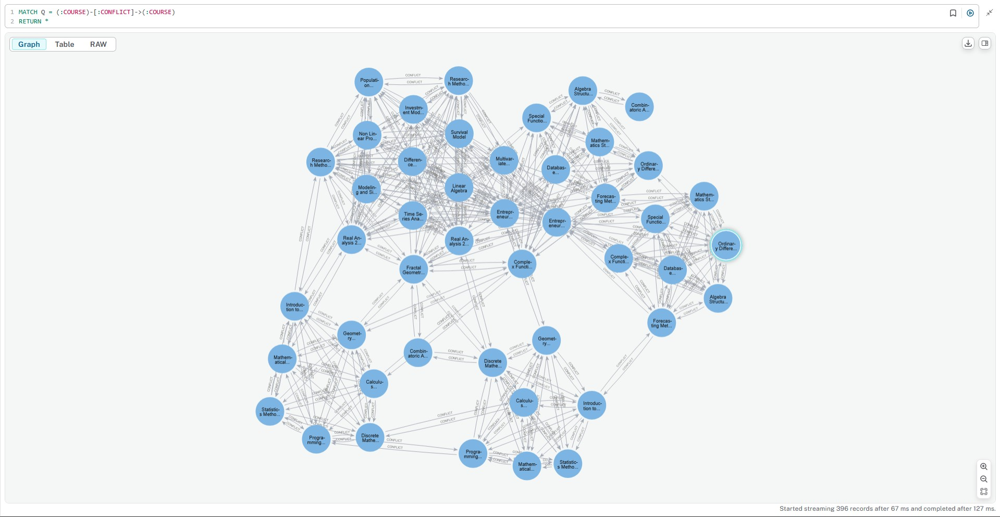

# GENERATE COURSE SCHEDULE USING GRAPH COLORING METHOD WITH NEO4J
Lectures and courses data is taken from Mathematics Department of FMIPA UNPAD in even semester of 2020/2021.


## Prerequisite:
1. Docker
2. Python 3.8+

## Steps
1. Install Neo4j container
```PowerShell
docker compose up
```
2. Install all required libraries
```Python
pip install -r requirements.txt
```

3. Initiate data
```Python
python query/initial_data.py
```

You will get three entities; course. lecturer, and student with example in the following images.

<br></br>
<br></br>
<br></br>

4. Connect Lecturers and Students to Courses
```Python
python query/lecturers-courses.py

python query/students-courses.py
```

You will have each node of course, lecturer, and student are connected by relationship take and teach for student and lecturer to course respectively. If same student or lecturer is connected to multiple course nodes will cause course nodes to have conflict relationship due to conflict that courses can not be scheduled in the same time.

<br></br>
<br></br>
<br></br>

5. Generate schedule
```Python
python query/generating_schedule.py 
```
You will have the schedule in .xlsx formatted file